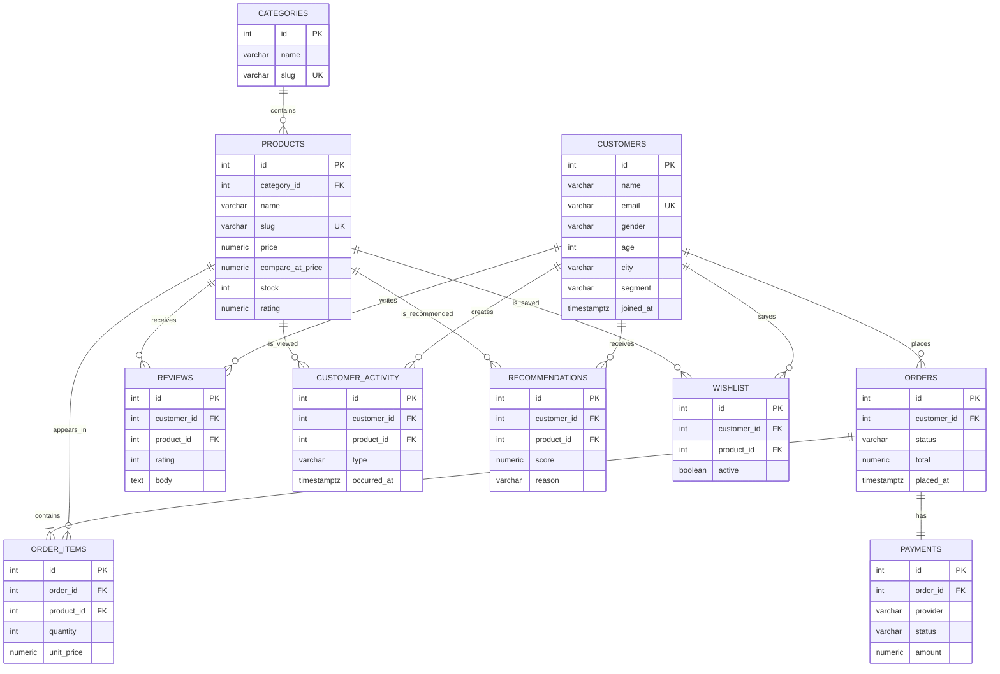

# Intelligent Commerce ER diagram

The application uses a normalized relational model. Category and customer
attributes are stored once, while repeating order and activity facts are kept
in child tables.

## Relationship notes

- `customers → orders`, `customers → reviews`, `customers → customer_activity`,
  `customers → recommendations`, and `customers → wishlist` are one-to-many.
- `categories → products` is one-to-many.
- `orders → order_items` is one-to-many; `products → order_items` is the
  corresponding product-side relationship.
- `orders → payments` is one-to-one because a payment has a unique order ID.
- Reviews, wishlist rows, and recommendation rows use customer/product
  uniqueness where a duplicate relationship would not be meaningful.